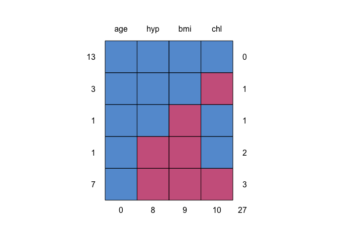
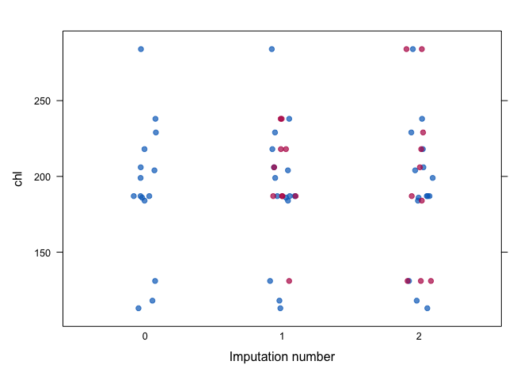

<!-- README.md is generated from README.Rmd. Please edit that file -->

# mice <a href="https://amices.org/mice/"></a>

<!-- badges: start -->

[](https://cran.r-project.org/package=mice)
[](https://cran.r-project.org/package=mice)
[](https://github.com/amices/mice/actions/workflows/R-CMD-check.yaml)
[](https://amices.org/mice/)
<!-- badges: end -->

## [Multivariate Imputation by Chained Equations](https://amices.org/mice/)

The [`mice`](https://cran.r-project.org/package=mice) package implements
a method to deal with missing data. The package creates multiple
imputations (replacement values) for multivariate missing data. The
method is based on Fully Conditional Specification, where each
incomplete variable is imputed by a separate model. The `MICE` algorithm
can impute mixes of continuous, binary, unordered categorical and
ordered categorical data. In addition, MICE can impute continuous
two-level data, and maintain consistency between imputations by means of
passive imputation. Many diagnostic plots are implemented to inspect the
quality of the imputations.

## Installation

The `mice` package can be installed from CRAN as follows:

``` r
install.packages("mice")
```

The latest version can be installed from GitHub as follows:

``` r
install.packages("devtools")
devtools::install_github(repo = "amices/mice")
```

## Minimal example

``` r
library(mice, warn.conflicts = FALSE)

# show the missing data pattern
md.pattern(nhanes)
```

<figure>

<figcaption aria-hidden="true">Missing data pattern of
<code>nhanes</code> data. Blue is observed, red is missing.</figcaption>
</figure>

    #>    age hyp bmi chl   
    #> 13   1   1   1   1  0
    #> 3    1   1   1   0  1
    #> 1    1   1   0   1  1
    #> 1    1   0   0   1  2
    #> 7    1   0   0   0  3
    #>      0   8   9  10 27

The table and the graph summarize where the missing data occur in the
`nhanes` dataset.

``` r
# multiple impute the missing values
imp <- mice(nhanes, maxit = 2, m = 2, seed = 1)
#> 
#>  iter imp variable
#>   1   1  bmi  hyp  chl
#>   1   2  bmi  hyp  chl
#>   2   1  bmi  hyp  chl
#>   2   2  bmi  hyp  chl

# inspect quality of imputations
stripplot(imp, chl, pch = 19, xlab = "Imputation number")
```

<figure>

<figcaption aria-hidden="true">Distribution of <code>chl</code> per
imputed data set.</figcaption>
</figure>

In general, we would like the imputations to be plausible, i.e., values
that could have been observed if they had not been missing.

``` r
# fit complete-data model
fit <- with(imp, lm(chl ~ age + bmi))

# pool and summarize the results
summary(pool(fit))
#>          term estimate std.error statistic    df p.value
#> 1 (Intercept)     9.08     73.09     0.124  4.50  0.9065
#> 2         age    35.23     17.46     2.017  1.36  0.2377
#> 3         bmi     4.69      1.94     2.417 15.25  0.0286
```

The complete-data is fit to each imputed dataset, and the results are
combined to arrive at estimates that properly account for the missing
data.

## `mice 3.0`

Version 3.0 represents a major update that implements the following
features:

1.  `blocks`: The main algorithm iterates over blocks. A block is simply
    a collection of variables. In the common MICE algorithm each block
    was equivalent to one variable, which - of course - is the default;
    The `blocks` argument allows mixing univariate imputation method
    multivariate imputation methods. The `blocks` feature bridges two
    seemingly disparate approaches, joint modeling and fully conditional
    specification, into one framework;

2.  `where`: The `where` argument is a logical matrix of the same size
    of `data` that specifies which cells should be imputed. This opens
    up some new analytic possibilities;

3.  Multivariate tests: There are new functions `D1()`, `D2()`, `D3()`
    and `anova()` that perform multivariate parameter tests on the
    repeated analysis from on multiply-imputed data;

4.  `formulas`: The old `form` argument has been redesign and is now
    renamed to `formulas`. This provides an alternative way to specify
    imputation models that exploits the full power of R’s native
    formula’s.

5.  Better integration with the `tidyverse` framework, especially for
    packages `dplyr`, `tibble` and `broom`;

6.  Improved numerical algorithms for low-level imputation function.
    Better handling of duplicate variables.

7.  Last but not least: A brand new edition AND online version of
    [Flexible Imputation of Missing Data. Second
    Edition.](https://stefvanbuuren.name/fimd/)

See [MICE: Multivariate Imputation by Chained
Equations](https://amices.org/mice/) for more resources.

I’ll be happy to take feedback and discuss suggestions. Please submit
these through Github’s issues facility.

## Resources

### Books

1.  Van Buuren, S. (2018). [Flexible Imputation of Missing Data. Second
    Edition.](https://stefvanbuuren.name/fimd/). Chapman & Hall/CRC.
    Boca Raton, FL.

### Course materials

1.  [Handling Missing Data in `R` with
    `mice`](https://amices.org/Winnipeg/)
2.  [Statistical Methods for combined data
    sets](https://stefvanbuuren.name/RECAPworkshop/)

### Vignettes

1.  [Ad hoc methods and the MICE
    algorithm](https://www.gerkovink.com/miceVignettes/Ad_hoc_and_mice/Ad_hoc_methods.html)
2.  [Convergence and
    pooling](https://www.gerkovink.com/miceVignettes/Convergence_pooling/Convergence_and_pooling.html)
3.  [Inspecting how the observed data and missingness are
    related](https://www.gerkovink.com/miceVignettes/Missingness_inspection/Missingness_inspection.html)
4.  [Passive imputation and
    post-processing](https://www.gerkovink.com/miceVignettes/Passive_Post_processing/Passive_imputation_post_processing.html)
5.  [Imputing multilevel
    data](https://www.gerkovink.com/miceVignettes/Multi_level/Multi_level_data.html)
6.  [Sensitivity analysis with
    `mice`](https://www.gerkovink.com/miceVignettes/Sensitivity_analysis/Sensitivity_analysis.html)
7.  [Generate missing values with
    `ampute`](https://rianneschouten.github.io/mice_ampute/vignette/ampute.html)
8.  [`futuremice`: Wrapper for parallel MICE imputation through
    futures](https://www.gerkovink.com/miceVignettes/futuremice/Vignette_futuremice.html)

### Code from publications

1.  [Flexible Imputation of Missing Data. Second
    edition.](https://github.com/stefvanbuuren/fimdbook/tree/master/R)

## Acknowledgement

The cute mice sticker was designed by Jaden M. Walters. Thanks Jaden!

## Code of Conduct

Please note that the mice project is released with a [Contributor Code
of Conduct](https://amices.org/mice/CODE_OF_CONDUCT.html). By
contributing to this project, you agree to abide by its terms.
