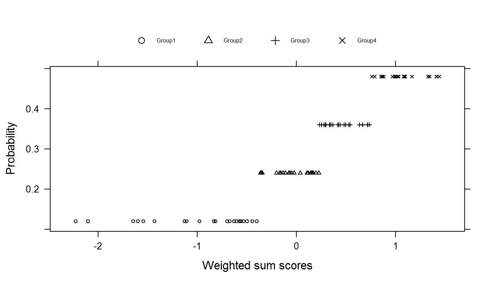

When new multiple imputation techniques are tested, simulated data sets have to be made incomplete. Often, a univariate amputation procedure is followed, and then repeated multiple times in case several variables should have missing values. Van Buuren (2012: 63, 64) explains in detail how this can be done. However, there are a few drawbacks of this method. First, a univariate approach makes it difficult to relate the missingness on one variable to the missingness on another variable. Second, both simulated and real data have a multivariate structure. Applying a univeriate amputation procedure to multivariate data would not do justice to the complicated nature of data sets. Third, as Vink (2016) explains in his paper 'Towards a standardized evaluation of multiple imputation 
routines', one common amputation method might be useful in comparing existing and new imputation techniques. Hence, the function `ampute` is created to perform the amputation according the researcher's desires.

```{r, include = FALSE}
# Load packages
require("MASS")
require("mice")
require("lattice")
require("gridExtra")

# Underlying functions
source("../R/ampute.mcar.R")
source("../R/ampute.continuous.R")
source("../R/ampute.discrete.R")
source("../R/ampute.default.R")
source("../R/is.R")
source("../R/print.R")
source("../R/summary.R")
source("../R/bwplot.mads.R")
source("../R/xyplot.mads.R")
source("../R/mads.R")
source("../R/mdc.R")
source("../R/supports.transparent.R")

# Main function
source("../R/ampute.R")

set.seed(2016)
```

\begin{figure}[t]
  \includegraphics[width=\linewidth]{Flowchart.pdf}
  \captionsetup{justification=raggedright,
singlelinecheck=false}
  \caption{Step-by-Step flowchart of R-function ampute}
  \label{fig1}
\end{figure}

Figure \ref{fig1} gives an overview of the options that can be used when choosing an amputation procedure. Obviously, a quick use of `ampute` is possible, but for a specific design, the steps in Figure 1 show a logical order in which the decisions can be made. This vignette will use these same steps. 

### 1. Data and quick amputation

First, a complete data set should be at hand. One could easily simulate one using `mvrnorm()` from the package `MASS`. Be aware that the covariance matrix should be semi definite. 

```{r}
testdata <- mvrnorm(n = 10000, mu = c(10, 5, 0), 
                    Sigma = matrix(data = c(1.0, 0.2, 0.2, 0.2, 1.0, 0.2, 
                                            0.2, 0.2, 1.0), nrow = 3, byrow = T))
testdata <- as.data.frame(testdata)
summary(testdata)
```

The function `ampute` immediately works when the data are entered into the function. Storing the result allows you to work with the amputed data. 

```{r}
result <- ampute(testdata)
result
```

#### Class

The return object is of class `mads` (Multivariately Amputed Data Set) and contains all the useful information about the amputation. In total, the object contains the following:

```{r}
names(result)
```

#### Inspect amputed data

The amputed data is stored under `amp`. To see whether the amputation has gone according plan, a quick investigation can be done by using `md.pattern` from package `mice`. 

```{r}
md.pattern(result$amp)
```

The rows of the table show the different missing data patterns with the number of cases accordingly. The first row always refers to the complete cases. The last column contains the number of variables with missings in that specific pattern. Consequently, the values at the end of each column are the total number of cells that are missing for that variable. A more thorough explanation of the function can be obtained by `?md.pattern`. Note that because `md.pattern` sorts the columns in increasing amounts of missing information, the order of the variables is different from the order in the data. 

### 2. Proportion of missingness

The proportion of missingness is specified under:

```{r}
result$prop
```

In the default setting, this means that 50% of the cases will have missing values. It is easy to change this proportion by using the argument `prop`. One might also want to specify the percentage of missing information. For this, the argument `bycases` should be `FALSE`. 

```{r}
result <- ampute(testdata, prop = 0.2, bycases = FALSE)
md.pattern(result$amp)
``` 

An inspection of the result shows that the proportion of missing cells is now 20% (6000 missing values / (10000 * 3)), as requested. `ampute` automatically calculates the proportion of missing cases that belongs to this setting. 

```{r}
result$prop
```

### 3. Patterns

The basic idea of `ampute` is the creation of missingness patterns. Each pattern is a combination of missingness on specific variables while other variables remain complete. For example, someone could have forgotten the last part page of a questionnaire, resulting in missingness on a specific set of questions or variables. Another missingness pattern could occur when someone is not willing to answer private questions. Or when a participant misses a wave in a longitudinal study. Consequently, each pattern is a specific combination of missing and complete variables. 

The default missingness patterns can by obtained by:  

```{r}
mypatterns <- result$patterns
mypatterns
```

In the `patterns` matrix, each row refers to a missing data pattern and each column to a variable. `0` is used for variables that should have missing values in a particular pattern. `1` is used otherwise. Here, three missing data patterns are specified with missing values on 1 variable only. Note that as a result of this, none of the cases will have missingness on more than one variable. A case either has missingness on V1, V2 or V3 or remains complete.  

Subsequently, the default `patterns` matrix can be changed according the researcher's desires. For example, for longitudinal data, the missingness patterns might be changed into:

```{r}
mypatterns[2, ] <- c(0, 0, 1)
mypatterns <- rbind(mypatterns, c(0, 1, 0))
mypatterns
```

By doing this, a missingness pattern is created where cases will have missingness on V1 and V2 but not on V3 (pattern 2). Also, I have added a fourth missing data pattern to create a combinaton of missingness on V1 and V3. Note that each pattern must contain at least one `0` or `1`. 

Now, I can ampute the data another time, with the desired `patterns` matrix as its third argument. Note that I have changed the desired proportion of missingness to `bycases = TRUE` (default) and 30%. 

```{r}
result <- ampute(testdata, prop = 0.3, patterns = mypatterns)
md.pattern(result$amp)
```

### 4. Relative frequency

The function `ampute` works by assigning cases to the different missing data patterns. Each case is assigned to one pattern only, and all cases are divided among the patterns. In other words, every case is **candidate** for a certain missing data pattern. This does not automatically mean that each case will obtain missing values. That decision will be made later on. 

The argument `freq` specifies with which frequency the cases should be divided over the patterns. As a default, equal frequencies are used for the patterns.  

```{r}
result$freq
```

The specifications below are an example of a situation where one wants to impose missing data pattern 1 with a higher frequency than that of the other missing data patterns. When changing the `freq` argument, one should keep in mind that the sum of the relative frequencies should be 1 (in order to divide all the cases over the patterns). 

```{r}
result <- ampute(testdata, prop = 0.3, patterns = mypatterns, 
                 freq = c(0.7, 0.1, 0.1, 0.1))
md.pattern(result$amp)
```

### 5. Mechanism

At this point, the total proportion of missingness is defined, the missing data patterns are specified as well as the relative frequency with which they should occur. All cases are candidate for a missing data pattern. 

Whether a case will be made missing eventually, depends on the missingness mechanism. If each case should have an equal probability of having missing values, the argument `mechanism` should be changed to `"MCAR"` (Missing Completely At Random). Also, the arguments from 6 and further may be passed over.   
```{r}
result <- ampute(testdata, prop = 0.3, patterns = mypatterns, 
                 freq = c(0.7, 0.1, 0.1, 0.1), mech = "MCAR")
result$mech
```

### 6. Weights

In case of `MAR` missingness, which is the default setting of `mechanism`, a weighted sum score will be calculated for each case. This is an important part in the process because the probability that a case will be made missing, depends on this score. In what way the sum scores are used, will be explained in part 8 and part 9 of this vignette. 

The weighted sum scores are built from the variable values and certain pre-specified weights. For each case, the value on a certain variable is multiplied with a weight. This is done for all variables and the resulting values are summed: a weighted sum score. The formula that describes the calculation is: 

\begin{equation}
c_{ik} = \sum\limits_{j=1}^J w_{jk}*c_{ij}
\end{equation}

where $c_{ik}$ is a case $i$ in a certain pattern $k$, $w_{jk}$ is the pre-specified weight of a certain variable $j$ in a certain pattern $k$ and $c_{ij}$ is the value of case $i$ on variable $j$. In the example, $j\in\{1, 2, 3\}$ and $k\in\{1, 2, 3, 4\}$ because there are three variables and four missing data patterns. The `weights` matrix stores the $w_{jk}$ and is of size #patterns by #variables. The default of this matrix is as follows:   

```{r}
myweights <- result$weights
myweights
```

As you see, in each pattern, all variables are equally weighted. In this situation, a case with high values on all three variables, would have a high weighted sum score. 

However, we could also desire to weight the values on variable V2 heavier than the values on variable V3. For pattern 1, we could decide on something as: 

```{r}
myweights[1, ] <- c(0, 0.8, 0.4)
```

In pattern 1, variable V1 will be made missing. Consequently, the weight for variable V1 will not be used in the calculation of the weighted sum scores. The value in the `weights` matrix is therefore not important. By choosing the values 0.8 and 0.4, variable V2 is weighted twice as heavy as variable V3. The values are relative values, meaning that choosing the values 8 and 4 would have the same effect on the amputation process. In order to clearly see the result of the `weights` setting, one can specify weights for just a few variables and with a relative big distance from each other. 

The `patterns` object can be checked to see which variables are of importance for specific patterns. Because in pattern 2 and 4 the weighted sum scores depend on one variable only, the weights are not useful there. For pattern 3, variable V1 will be weighted three times as heavy as variable V2. 

```{r}
result$patterns
myweights[3, ] <- c(3, 1, 0)
myweights
```

Applying the new `weights` matrix results to the following amputation. 

```{r}
result <- ampute(testdata, prop = 0.3, patterns = mypatterns, 
                 freq = c(0.7, 0.1, 0.1, 0.1), weights = myweights)
```

#### Inspect effect specifications

Apart from using `md.pattern` there are several plottings options available to inspect the data. 

###### Boxplots

First, there is the function `bwplot` that can be imposed on the `mads` object immediately. `bwplot` plots the distributions of the amputed and non-amputed data for several variables. This is useful, because this makes it possible to relate the missingness to the different variables. In other words, by examining the boxplots one can see for which values of a certain variable, the data will be amputed. Note that not necessary the values of the variables themselves will be amputed. The variable values that will be amputed are defined by the `0` in the `patterns` object. The boxplots merely show the relation between the amputations and the variables. 

The argument `which.pat` can be used to define the patterns one is interested in (default: all patterns). The argument `yvar` should contain the variables names (default: all variables). Besides, the function returns the mean, variance and n of the amputed and non-amputed data for each variable and each pattern requested. In the column `"Amp"`, a `1` refers to the amputed data and `0` to the non-amputed data. If the descriptives are not required, the argument `descriptives` can be set to `FALSE`. 

```{r}
bwplot(result, which.pat = c(1, 3))
```

The medians and boundaries of the boxes show that in pattern 1, the amputed data is shifted to the right with respect to the non-amputed data. For variable V2, this effect is the biggest, due to the weight value that was specified. For X1, there is a very small difference between the boxplots of the amputed and non-amputed data. This makes sense, because variable V1 was amputed in the first pattern and therefore not guiding the amputation. The small difference is due to the positive correlation between V1 on the one side and V2 and V3 on the other side. These correlations were created during the simulation of the data. 

If desired, one could use the function `tsum.test` from package `BSDA` to perform a t-test on the amputed and non-amputed data. For example, to know whether the mean difference between the amputed and non-amputed data for variable V2 in pattern 1 is significant, one could run:

```{r, include = FALSE}
require(BSDA)
```

```{r}
tsum.test(mean.x = 0.28658, mean.y = -0.43007,
          s.x = sqrt(0.9066), s.y = sqrt(0.87766),
          n.x = 4136, n.y = 2722)
```

As is visible, there is a significant difference between the amputed and non-amputed data of variable V2 in pattern 1. 

For pattern 3, the difference between the distributions of the amputed and non-amputed data is biggest for variable V1, as expected due to the weights values in pattern 3. 

###### Scatterplots

Scatterplots might also help to investigate the effect of the specifications. For example, the weighted sum scores of pattern 1 can be set against the three variables. 

```{r}
xyplot(result, which.pat = 1)
```

The scatterplots show that there is a very small relation between V1 and the weighted sum scores. Furthermore, the relation between V2 and the weighted sum scores is very strong, meaning that a case's value on V2 is very important in the creation of the weighted sum score. This is actually what causes the differences between the amputed and non-amputed data in the boxplots above. For V3 and the weighted sum scores, the relation is a bit weaker than for V2 but much more than V1. 

### 7. Continuous

As a default, `ampute` creates continuous missingness. This means that logit probability functions are used to define a candidate's probability of having missing values. Thereafter, the type of amputation can be decided under `type`. A more thorough explanation of how the logit functions work will be given in part 8 of the vignette.

Instead of using continuous formulas to specify the missingness probabilities, these can also be defined by hand. For this, the argument `cont` should be set to `FALSE`. The `odds` argument can be used to define the probabilities (see part 9. 

### 8. Type

The logit functions are more thoroughly explained by Van Buuren (2012, pp. 63, 64), but a quick overview will be given here. Four MAR missingness functions are known: RIGHT, MID, TAIL and LEFT missingness. Figure \ref{fig2} shows the course of the probabilities for standardized values. 

```{r, include = FALSE}

logistic <- function(x){
  exp(x)/(1+exp(x))
} 
x1 <- seq(-3, 3, 0.01)
y1 <- logistic(-mean(x1)+x1[])
data2 <- as.data.frame(matrix(c(x1, y1), 601, 2))
names(data2) <- c("X1", "Y")
data2[602:1202, "X1"] <- x1
data2[602:1202, "Y"] <- logistic(-abs(x1[]-mean(x1))+0.75)
data2[1203:1803, "X1"] <- x1
data2[1203:1803, "Y"] <- logistic(abs(x1[]-mean(x1))-0.75)
data2[1804:2404, "X1"] <- x1
data2[1804:2404, "Y"] <- logistic(mean(x1)-x1[])
data2["Type"] <- c(rep("RIGHT", 601), rep("MID", 601), rep("TAIL", 601), rep("LEFT", 601))
plot1 <- xyplot(Y ~ X1, data2, group = Type, t = 'l', 
       lty=c(1,2,3,4), 
       cex = 0.5, col = rep("black", 4),
       xlab = "Values", ylab = "Probability",
       key=list(space="top", columns=4, lines = list(lty = c(1, 2, 3, 4)), text = list(c("LEFT", "MID", "RIGHT", "TAIL"), cex = 0.5)))

png(filename="plot1.png", 
    type="cairo",
    units="in", 
    width=7, 
    height=4, 
    pointsize=12, 
    res=200)
plot1
dev.off()
```

\begin{figure}[h!]
  \includegraphics[width=\linewidth]{plot1.png}
  \captionsetup{justification=raggedright,
singlelinecheck=false}
  \caption{Continuous MAR Functions}
  \label{fig2}
\end{figure}

In `ampute`, the logit functions will be performed on the weighted sum scores. Consequently, in the situation of RIGHT missingness, cases with high weighted sum scores will have a higher probability to have missing values, compared to cases with low weighted sum scores. For MID missingness, the high probabilities are given to the cases with weighted sum scores around the average.

For each pattern, a different missingness type can be chosen. In our example, we have four patterns, so four types are required. It is advised to inspect the result with `bwplot` (below is the result of this plot for pattern 2), although the scatterplots give insight as well (as an example, a plot for pattern 4 is shown). 

```{r}
result <- ampute(testdata, prop = 0.3, patterns = mypatterns, 
                 freq = c(0.7, 0.1, 0.1, 0.1), weights = myweights,
                 type = c("RIGHT", "TAIL", "MID", "LEFT"))
bwplot(result, which.pat = 2, descriptives = FALSE)
```

From the boxplots of pattern 2, it becomes visible that the interquartile range (IQR) is much bigger for the amputed V3 values compared to the non-amputed data. This is due to the fact that in pattern 2, only V3 defines the missingness. Besides, we requested a MARTAIL missingness type, which means that all the cases with values at the tails of the distribution of the weighted sum scores (based on merely V3), will be made missing. 

```{r}
xyplot(result, which.pat = 4)
```

First, notice that there are much fewer dots in these scatterplots compared to the scatterplots we saw earlier. This is due to the `freq` setting: we specified that only 10 percent of the cases with missing values should have missingness pattern 4. Second, the scatterplots show that all the amputed data is at the left hand side of the weighted sum scores, due to the `"LEFT"` setting in the `type` argument. The last important aspect of these figures is the perfect relation between V2 and the weighted sum scores. Clearly, pattern 4 depends on variable V2 only. Do you remember the `weights` setting that was used?  

```{r}
result$weights
```

### 9. Odds

If the missingness probabilities should not depend on a continuous probability function, the user will have to define the probability to be missing. This method is first described by Brand (1999). 

First, one has to decide in how many groups the weighted sum scores should be divided. Second, for each group, an odds value defines the relative probability of having missing values. 

In other words, each case that is candidate for a certain missing data pattern, will be assigned to a group based on his weighted sum score. On page 15, the contents of the `odds` matrix will be explained more deeply, but let us first have a look at the working of the odds values. 

The default `odds` matrix is as follows:  

```{r}
myodds <- result$odds
myodds
```

For pattern 1, the candidates will be divided into four groups. This is done based on quantiles, in order to obtain equally sized groups. The values `c(1, 2, 3, 4)` mean that a case with a weighted sum score in the highest quantile, will have a probability of having missing values that is four times higher than a candidate with a weighted sum score in the lowest quantile. In Figure \ref{fig3} the different probabilities that belong to this setting are shown for 100 cases. 

```{r, include = FALSE}
len <- length(result$scores[[1]])
R <- sample(x = c(1, 0), size = len, 
            prob = c(100 / len, (len - 100) / len), replace = TRUE)
data3 <- matrix(NA, length(R[R == 1]), 3)
data3[, 1] <- result$scores[[1]][R == 1]
ng <- length(result$odds[1, ][!is.na(result$odds[1, ])])
quantiles <- quantile(data3[, 1], probs = seq(0, 1, by = 1 / ng))
Q <- rep(NA, length(data3[, 1]))
for (k in 1:ng) {
  Q <- replace(Q, data3[, 1] >= quantiles[k] 
               & data3[, 1] <= quantiles[k + 1], k)
}
data3[, 2] <- Q
for (l in 1:ng) {
data3[data3[, 2] == l, 3] <- (ng * result$prop * result$odds[1, l]) / 
  sum(result$odds[1, ], na.rm = TRUE)
}
data3 <- as.data.frame(data3)
names(data3) <- c("scores", "group", "prob")
plot2 <- xyplot(prob ~ scores, data = data3, groups = group,
                ylab = "Probability", xlab = "Weighted sum scores",
                pch=c(1,2,3,4), 
                cex = 0.5, col = rep("black", 4),
                key=list(space="top", columns=4, title="", 
                         cex = 1, points = list(pch = c(1, 2, 3, 4)), 
                         text = list(c("Group1", "Group2", "Group3", "Group4"), 
                                     cex = 0.5)))
dat <- result$data[result$cand == 1, "V2"]
data3["V2"] <-  dat[R == 1]
dat <- result$data[result$cand == 1, "V3"]
data3["V3"] <-  dat[R == 1]
plot3 <- xyplot(V3 ~ V2, data = data3, groups = group,
                ylab = "V3", xlab = "V2", 
                pch=c(1,2,3,4), 
                cex = 0.8, col = rep("black", 4),
                key=list(space="top", columns=4, title="", 
                         cex = 1, points = list(pch = c(1, 2, 3, 4)), 
                         text = list(c("Group1", "Group2", "Group3", "Group4"), 
                                     cex = 0.5)))

png(filename="plot2.png", 
    type="cairo",
    units="in", 
    width=7, 
    height=4, 
    pointsize=12, 
    res=200)
plot2
dev.off()
png(filename="plot3.png", 
    type="cairo",
    units="in", 
    width=7, 
    height=4, 
    pointsize=12, 
    res=300)
plot3
dev.off()
```



\begin{figure}[h!]
  \includegraphics[width=\linewidth]{plot2.png}
  \captionsetup{justification=raggedright,
singlelinecheck=false}
  \caption{Probabilities to have missing values for the four groups in pattern 1 and the relation between the groups and the weighted sum scores.}
  \label{fig3}
\end{figure}

As can be seen, there are indeed four groups in pattern 1, with each a certain probability to obtain missing values. 

The relation between the groups and the variable values is shown Figure \ref{fig4} Because the relationship between variable V2 and the weighted sum scores is high (due to the `weights` setting), the groups can be distinguished very well. Besides, for higher values of V2, the weighted sum scores are higher. The cases with these values are in group 4 and therefore at the right hand side of the V2 scale. For V3, the relation between the values and the group allocation is small. This again is due to the `weights` setting. Still, because of the odds values, group 4 is much more to the right of the V3 scale than group 1 (and 2 and 3). 

\begin{figure}[h!]
  \includegraphics[width=\linewidth]{plot3.png}
  \captionsetup{justification=raggedright,
singlelinecheck=false}
  \caption{Division of groups over variables V2 and V3}
  \label{fig4}
\end{figure}

Let us now go deeper into the contents of the `odds` matrix. The number of rows of this matrix is equal to #patterns. The number of columns can be defined by the user and depends on the desired amputation procedure. 

The amount of values in each row defines the number of groups that will be created from the weighted sum scores in that specific pattern. This number can be different for the different patterns. The values themselves define the odds probabilities of having missing values. Note that the values are relative values. A setting of `c(2, 6)` is similar to `(3, 9)`, for instance. 

The cells in the `odds` matrix that are not used, should be filled with NAs. 
Let us define the matrix as follows. 

```{r}
myodds[3, ] <- c(1, 0, 0, 1)
myodds[4, ] <- c(1, 1, 2, 2)
myodds <- cbind(myodds, matrix(c(NA, NA, NA, 1, NA, NA, NA, 1), nrow = 4, byrow = F))
myodds
```

We let the default setting of the first two patterns remain. Then, for pattern 3, the weighted sum scores will be divided into four groups. The odds values mean that candidates with low weighted sum scores will have a probability to have missing values that is equal to the one of candidates with high weighted sum scores. However, candidates with weighted sum scores around average will not be made missing. Because pattern 3 depends on variable V1 with a weight of 3 and on variable V2 with a weight of 1, the effect will be best visibly for variable V1. 

The weighted sum scores of the fourth pattern will be divided into six groups. All candidates will have a probability of having missing values, but this chance is highest for candidates with weighted sum scores around average. 

```{r}
result <- ampute(testdata, prop = 0.3, patterns = mypatterns, 
                 freq = c(0.7, 0.1, 0.1, 0.1), weights = myweights,
                 cont = FALSE, odds = myodds)
bwplot(result, which.pat = c(3, 4), descriptives = FALSE)
```

In the boxplots of pattern 3, it is visible that the amputed data has longer tails than the non-amputed data. This is especially the case for variable V1, a bit less for variable V2 and almost not present for variable V3.

In pattern 4, the effect of the specifications is only visible for variable V2, because the other variables will be made missing. In contrast to pattern 3, the amputation is performed in the center of the weighted sum scores, resulting to a MARMID-like missingness pattern. 

### 10. Other specifications

#### Argument `run`

For big data sets or slow computers, one might not want to perform the amputation right away. When the argument `run` is set to `FALSE`, all results will be stored in the `mads` object except for the amputed data set. Subsequently, the default settings for the `patterns`, `weights` or `odds` argument an be changed easily. Thereafter, a full run can be performed. 

```{r}
emptyresult <- ampute(testdata, run = FALSE)
emptyresult$amp
```

#### Other `mads` contents

The return object from `ampute` is of class `mads`. `mads` contains the amputed data set, the function specifications and some extra objects that might be useful. 

The object `cand` is a vector that contains for every case the missing data pattern it was candidate for. 

```{r}
result$cand[1:30]
```

The object `scores` is a list with, for each pattern, the weighted sum scores of the candidates. 

```{r}
result$scores[[1]][1:10]
```

Furthermore, the object `data` contains the original data. 

```{r}
head(result$data)
```

Go ahead and `ampute`!

### References

Brand, J.P.L. (1999). \emph{Development, implementation and 
evaluation of multiple imputation strategies for the statistical analysis of 
incomplete data sets} (pp. 110-113). Dissertation. Rotterdam: Erasmus University.

Van Buuren, S. (2012). \emph{Flexible imputation of missing data} (pp. 63-64). 
Boca Raton, FL.: Chapman & Hall/CRC Press.

Vink, G. (2016). Towards a standardized evaluation of multiple imputation routines. 
