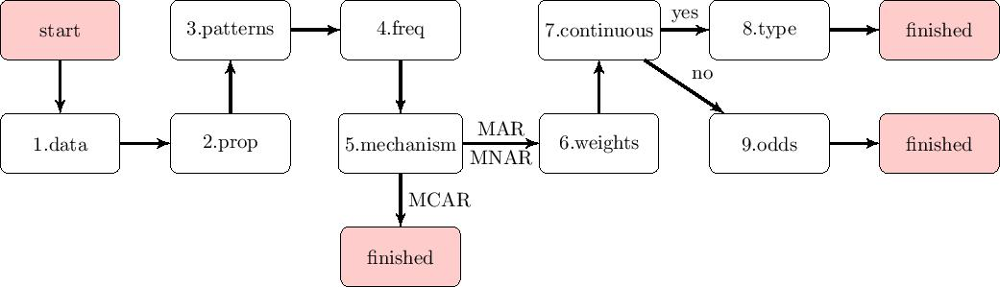
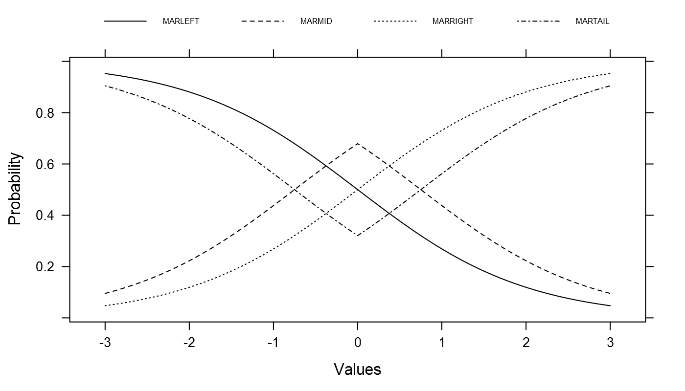
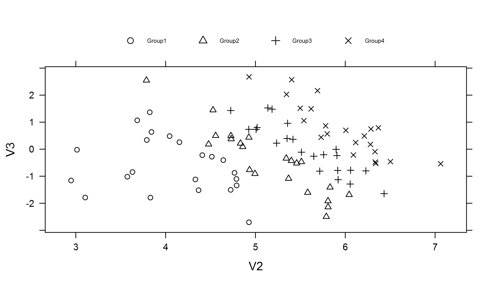

```{r, include = FALSE}
# Load packages
require("MASS")
require("mice")
require("lattice")
require("gridExtra")

# Underlying functions
source("../R/ampute.mcar.R")
source("../R/ampute.continuous.R")
source("../R/ampute.discrete.R")
source("../R/ampute.default.R")
source("../R/is.R")
source("../R/print.R")
source("../R/summary.R")
source("../R/bwplot.mads.R")
source("../R/xyplot.mads.R")
source("../R/mads.R")
source("../R/mdc.R")
source("../R/supports.transparent.R")

# Main function
source("../R/ampute.R")

set.seed(2016)
```

### Part 2 

This vignette shows the working of multivariate amputation function `ampute`. The approach is discussed following Figure 1. In part one of this vignette, step 1 to 6 were discussed. We will continue the vignette with step 7. 



```{r, include = FALSE}
testdata <- mvrnorm(n = 10000, mu = c(10, 5, 0), 
                    Sigma = matrix(data = c(1.0, 0.2, 0.2, 0.2, 1.0, 0.2, 
                                            0.2, 0.2, 1.0), nrow = 3, byrow = T))
testdata <- as.data.frame(testdata)
result <- ampute(testdata)
mypatterns <- result$patterns
mypatterns[2, 1] <- 0
mypatterns <- rbind(mypatterns, c(0, 1, 0))
result <- ampute(testdata, prop = 0.3, patterns = mypatterns, 
                 freq = c(0.7, 0.1, 0.1, 0.1))
myweights <- result$weights
myweights[1, ] <- c(0, 0.8, 0.4)
myweights[3, ] <- c(3, 1, 0)
result <- ampute(testdata, prop = 0.3, patterns = mypatterns, 
                 freq = c(0.7, 0.1, 0.1, 0.1), weights = myweights)
```

### 7. Continuous

As a default, `ampute` creates continuous missingness. This means that logit probability functions are used to define a candidate's probability of having missing values. The type of continuous amputation can be decided under `type`. A more thorough explanation of how the logit functions work will be given in part 8 of this vignette.

Instead of using continuous formulas to specify the missingness probabilities, these can also be defined by hand. For this, the argument `cont` should be set to `FALSE`. The `odds` argument can be used to define the probabilities (see part 9). 

### 8. Type

The logit functions are more thoroughly explained by Van Buuren (2012, pp. 63, 64), but a quick overview will be given here. Four missingness functions are known: RIGHT, MID, TAIL and LEFT missingness. Figure 2 shows the course of the probabilities for standardized values. 

```{r, include = FALSE}

logistic <- function(x){
  exp(x)/(1+exp(x))
} 
x1 <- seq(-3, 3, 0.01)
y1 <- logistic(-mean(x1)+x1[])
data2 <- as.data.frame(matrix(c(x1, y1), 601, 2))
names(data2) <- c("X1", "Y")
data2[602:1202, "X1"] <- x1
data2[602:1202, "Y"] <- logistic(-abs(x1[]-mean(x1))+0.75)
data2[1203:1803, "X1"] <- x1
data2[1203:1803, "Y"] <- logistic(abs(x1[]-mean(x1))-0.75)
data2[1804:2404, "X1"] <- x1
data2[1804:2404, "Y"] <- logistic(mean(x1)-x1[])
data2["Type"] <- c(rep("RIGHT", 601), rep("MID", 601), rep("TAIL", 601), rep("LEFT", 601))
plot1 <- xyplot(Y ~ X1, data2, group = Type, t = 'l', 
       lty=c(1,2,3,4), 
       cex = 0.5, col = rep("black", 4),
       xlab = "Standardized weighted sum scores", 
       ylab = "Probability",
       key=list(space="top", columns=4, lines = list(lty = c(1, 2, 3, 4)), text = list(c("LEFT", "MID", "RIGHT", "TAIL"), cex = 0.5)))

png(filename="plot1.png", 
    type="cairo",
    units="in", 
    width=7, 
    height=4, 
    pointsize=12, 
    res=200)
plot1
dev.off()
```



In `ampute`, the logit functions will be performed on the weighted sum scores. Consequently, in the situation of RIGHT missingness, cases with high weighted sum scores will have a higher probability to have missing values, compared to cases with low weighted sum scores. For MID missingness, the high probabilities are given to the cases with weighted sum scores around the average.

For each pattern, a different missingness type can be chosen. In our example, we have four patterns, so four types are required. It is advised to inspect the result with `bwplot` (below is the result of this plot for pattern 2), although the scatterplots give insight as well (as an example, a plot for pattern 4 is shown). 

```{r}
result <- ampute(testdata, prop = 0.3, patterns = mypatterns, 
                 freq = c(0.7, 0.1, 0.1, 0.1), weights = myweights,
                 type = c("RIGHT", "TAIL", "MID", "LEFT"))
```

```{r}
bwplot(result, which.pat = 2, descriptives = FALSE)
```

From the boxplots of pattern 2, it becomes visible that the interquartile range (IQR) is much bigger for the amputed V3 values compared to the non-amputed data. This is due to the fact that in pattern 2, only V3 defines the missingness. Besides, we requested a TAIL missingness type, which means that all the cases with values at the tails of the distribution of the weighted sum scores (based on merely V3), will be made missing.

```{r}
xyplot(result, which.pat = 4)
```

First, notice that there are much fewer dots in these scatterplots compared to the scatterplots we saw earlier. This is due to the `freq` setting: we specified that only 10 percent of the cases with missing values should have missingness pattern 4. Secondly, the scatterplots show that all the amputed data is at the left hand side of the weighted sum scores due to the `"LEFT"` setting in the `type` argument. Thirdly, these figures show the perfect relation between variable V2 and the weighted sum scores. Clearly, pattern 4 depends on variable V2 only, which we remember from the `weights` setting that was used.   

```{r}
result$weights
```

### 9. Odds

If the missingness probabilities should not depend on a continuous probability function, you will have to define the probabilities to be missing yourself. This method was first described by Brand (1999) and consists of two steps. First, one has to decide in how many groups the weighted sum scores should be divided. Secondly, for each group, an odds value defines the relative probability of having missing values. 

In other words, each case that is candidate for a certain missing data pattern, will be assigned to a group based on his weighted sum score. Let us first have a look at the working of the odds values. The default `odds` matrix is as follows:  
```{r}
myodds <- result$odds
myodds
```

This matrix means that for each pattern, the candidates will be divided into four groups. This division occurs based on quantiles, in order to obtain equally sized groups. The values `c(1, 2, 3, 4)` mean that a case with a weighted sum score in the highest quantile, will have a probability of having missing values that is four times higher than a candidate with a weighted sum score in the lowest quantile. In Figure 3 the different probabilities that belong to this setting are shown for 100 candidates of pattern 1. 

```{r, include = FALSE}
len <- length(result$scores[[1]])
R <- sample(x = c(1, 0), size = len, 
            prob = c(100 / len, (len - 100) / len), replace = TRUE)
data3 <- matrix(NA, length(R[R == 1]), 3)
data3[, 1] <- result$scores[[1]][R == 1]
ng <- length(result$odds[1, ][!is.na(result$odds[1, ])])
quantiles <- quantile(data3[, 1], probs = seq(0, 1, by = 1 / ng))
Q <- rep(NA, length(data3[, 1]))
for (k in 1:ng) {
  Q <- replace(Q, data3[, 1] >= quantiles[k] 
               & data3[, 1] <= quantiles[k + 1], k)
}
data3[, 2] <- Q
for (l in 1:ng) {
data3[data3[, 2] == l, 3] <- (ng * result$prop * result$odds[1, l]) / 
  sum(result$odds[1, ], na.rm = TRUE)
}
data3 <- as.data.frame(data3)
names(data3) <- c("scores", "group", "prob")
plot2 <- xyplot(prob ~ scores, data = data3, groups = group,
                ylab = "Probability", xlab = "Standardized weighted sum scores",
                pch=c(1,2,3,4), 
                cex = 0.5, col = rep("black", 4),
                key=list(space="top", columns=4, title="", 
                         cex = 1, points = list(pch = c(1, 2, 3, 4)), 
                         text = list(c("Group1", "Group2", "Group3", "Group4"), 
                                     cex = 0.5)))
dat <- result$data[result$cand == 1, "V2"]
data3["V2"] <-  dat[R == 1]
dat <- result$data[result$cand == 1, "V3"]
data3["V3"] <-  dat[R == 1]
plot3 <- xyplot(V3 ~ V2, data = data3, groups = group,
                ylab = "Variable V3", xlab = "Variable V2", 
                pch=c(1,2,3,4), 
                cex = 0.8, col = rep("black", 4),
                key=list(space="top", columns=4, title="", 
                         cex = 1, points = list(pch = c(1, 2, 3, 4)), 
                         text = list(c("Group1", "Group2", "Group3", "Group4"), 
                                     cex = 0.5)))

png(filename="plot2.png", 
    type="cairo",
    units="in", 
    width=7, 
    height=4, 
    pointsize=12, 
    res=200)
plot2
dev.off()
png(filename="plot3.png", 
    type="cairo",
    units="in", 
    width=7, 
    height=4, 
    pointsize=12, 
    res=300)
plot3
dev.off()
```




As can be seen, there are indeed four groups in pattern 1. The groups have an approximately equal size, with each a certain probability to obtain missing values. The probability of group 4 is indeed four times as big as the probability of group 1.  

The relation between the groups and the variable values is shown Figure 4. Because the relationship between variable V2 and the weighted sum scores is high (due to the `weights` setting), the groups can be distinguished very well. Besides, for higher values of V2, the weighted sum scores are higher. The cases with these values are in group 4 and therefore at the right hand side of the V2 scale. For variable V3, the relation between the values and the group allocation is small. This again is due to the `weights` setting. Still, because of the odds values, group 4 is much more to the right of the V3 scale than group 1, 2 and 3. 

Let us now go deeper into the contents of the `odds` matrix. The #rows of this matrix is equal to #patterns. The #columns can be defined by the user and depends on the desired amputation procedure. 

The amount of values in each row defines the number of groups that will be created from the weighted sum scores in that specific pattern. This number can be different for the different patterns. The values themselves define the odds probabilities of having missing values. Note that the values are relative values. For instance, a setting of `c(2, 6)` is similar to `c(3, 9)`.

The cells in the `odds` matrix that are not used, should be filled with NAs. Let us define the matrix as follows. 

```{r}
myodds[3, ] <- c(1, 0, 0, 1)
myodds[4, ] <- c(1, 1, 2, 2)
myodds <- cbind(myodds, matrix(c(NA, NA, NA, 1, NA, NA, NA, 1), nrow = 4, byrow = F))
myodds
```

We keep the default setting of the first two patterns. Then, for pattern 3, the weighted sum scores will be divided into four groups. The odds values mean that candidates with low weighted sum scores will have a probability to have missing values that is equal to the one of candidates with high weighted sum scores. However, candidates with weighted sum scores around average will not be made missing. Because pattern 3 depends on variable V1 with a weight of 3 and on variable V2 with a weight of 1, the effect will be most visible for variable V1. 

The weighted sum scores of the fourth pattern will be divided into six groups. All candidates will have a probability of having missing values, but this chance is highest for candidates with weighted sum scores around average. 

```{r}
result <- ampute(testdata, prop = 0.3, patterns = mypatterns, 
                 freq = c(0.7, 0.1, 0.1, 0.1), weights = myweights,
                 cont = FALSE, odds = myodds)
```

```{r}
bwplot(result, which.pat = c(3, 4), descriptives = FALSE)
```

In the boxplots of pattern 3, it is visible that the IQR of the amputed data is bigger than the one of the non-amputed data. This is especially the case for variable V1, a bit less for variable V2 and almost not at hand for variable V3.

In pattern 4, the effect of the specifications is only visible for variable V2, because the other variables will be made missing. In contrast to pattern 3, the amputation is performed in the center of the weighted sum scores, resulting to a MID-like missingness pattern. 

### 10. Combining missingness mechanisms

Function `ampute` imposes a certain missingness mechanism on all the patterns. If `mech == "MAR"`, for instance, all patterns specified under `patterns` are created with a `MAR` mechanism. Besides, all these patterns should be made missing based on either continuous (`cont == TRUE`) or discrete (`cont == FALSE`) probability distributions. 

In reality, you might want to generate multiple kinds of missingness mechanisms within the same data set. In order to do this, I advise to ampute one data set multiple times according the desired specifications. Thereafter, for each row of the original data set, a row can be sampled from the multiple amputed data sets. In case of three missingness mechanisms, 1/3 of the data set would be the result of amputation 1, 1/3 from amputation 2 and the last third from amputation 3. In total, all three amputation mechanisms will be generated in the data set. 

Below is an example of how this can be done. 

```{r}
ampdata1 <- ampute(testdata, patterns = c(0, 1, 1), prop = 0.2, mech = "MAR")$amp
ampdata2 <- ampute(testdata, patterns = c(1, 0, 1), prop = 0.5, mech = "MNAR")$amp
ampdata3 <- ampute(testdata, patterns = c(1, 1, 0), prop = 0.8, mech = "MCAR")$amp

indices <- sample(x = c(1, 2, 3), size = nrow(testdata), replace = TRUE, 
                  prob = c(1/3, 1/3, 1/3))

ampdata <- matrix(NA, nrow = nrow(testdata), ncol = ncol(testdata))
ampdata[indices == 1, ] <- as.matrix(ampdata1[indices == 1, ])
ampdata[indices == 2, ] <- as.matrix(ampdata2[indices == 2, ])
ampdata[indices == 3, ] <- as.matrix(ampdata3[indices == 3, ])

md.pattern(ampdata)
```

The function `md.pattern` does not show the mechanisms (`bwplot` or `xyplot` are more useful for this), but the different proportion that were specified show how the process works. 

20% of cases are amputed according a MAR mechanism, 50% according a MNAR mechanism and 80 percent according a MCAR mechanim. For each mechanism, merely one missingness pattern is created to clearly see the difference between the three amputation rounds. These rounds are imposed on the data with equal probabilities (1/3 each). Consequently, 1/3 of 20% of the cases have a MAR missingness mechanism, 1/3 of 50% of the cases have a MNAR missingness mechanism and 1/3 of 80% of the cases have a MCAR missingness mechanism. In total, this results to 50% of the cases having missing values. 

### 11. Other specifications

#### Argument `run`

For big data sets or slow computers, you might not want to perform the amputation right away. When the argument `run` is set to `FALSE`, all results will be stored in the `mads` object except for the amputed data set. Subsequently, the default settings for the `patterns`, `weights` or `odds` argument can be changed easily. Thereafter, a full run can be performed. 

```{r}
emptyresult <- ampute(testdata, run = FALSE)
emptyresult$amp
```

#### Other `mads` contents

The return object from `ampute` is of class `mads`. `mads` contains the amputed data set, the function specifications and some extra objects that might be useful. 

The object `cand` is a vector that contains for every case the missing data pattern it was candidate for. 

```{r}
result$cand[1:30]
```

The object `scores` is a list with, for each pattern, the weighted sum scores of the candidates. 

```{r}
result$scores[[1]][1:10]
```

Furthermore, the object `data` contains the original data. 

```{r}
head(result$data)
```

## Go ahead and `ampute`!

### References

Brand, J.P.L. (1999). \emph{Development, implementation and 
evaluation of multiple imputation strategies for the statistical analysis of incomplete data sets} (pp. 110-113). Dissertation. Rotterdam: Erasmus University.

Van Buuren, S. (2012). \emph{Flexible imputation of missing data.}
Boca Raton, FL.: Chapman & Hall/CRC Press.

Vink, G. (2016). Towards a standardized evaluation of multiple imputation routines. Unpublished article. 
